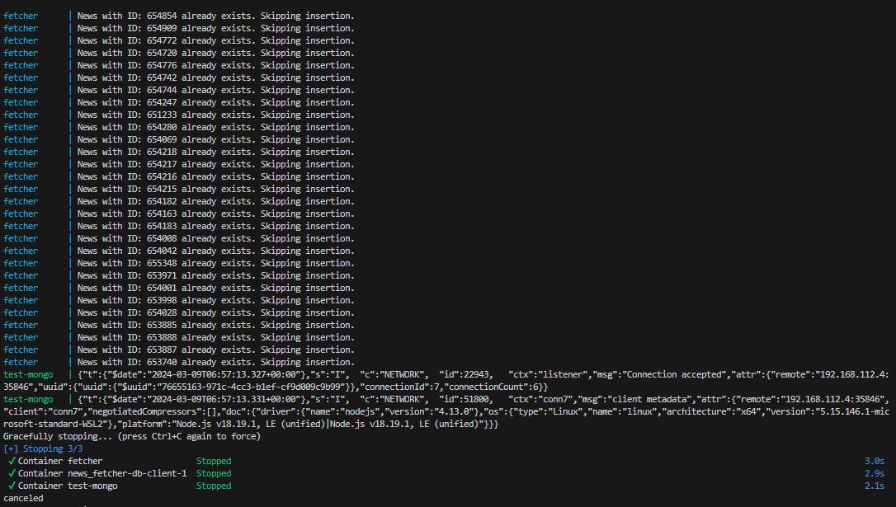

# News fetcher service
This repository contains code which fetchs data from sport news. 

## Task description

The project must meet the following requirements:
- Be written in Golang 
- Use MongoDB to store news articles 
- At regular intervals, poll the endpoint for new news articles
- Transform the XML feeds of news articles into appropriate model(s) and save them in the database
- Provide two REST endpoints which return JSON:
- Retrieve a list of all articles
- Retrieve a single article by ID
- Comments where appropriate

## HOWTO
- run with `make run`

## A picture is worth a thousand words

